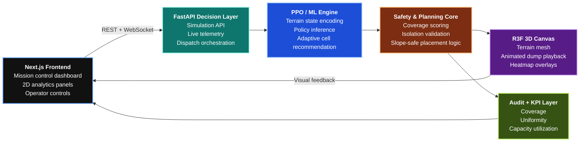
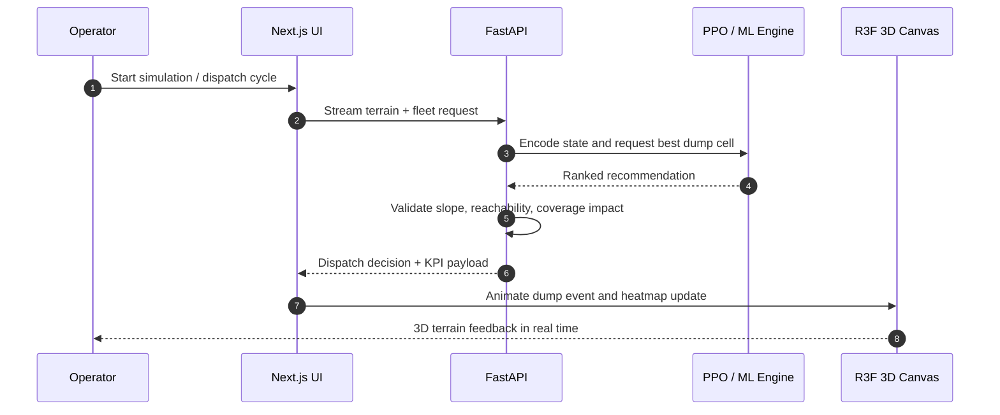
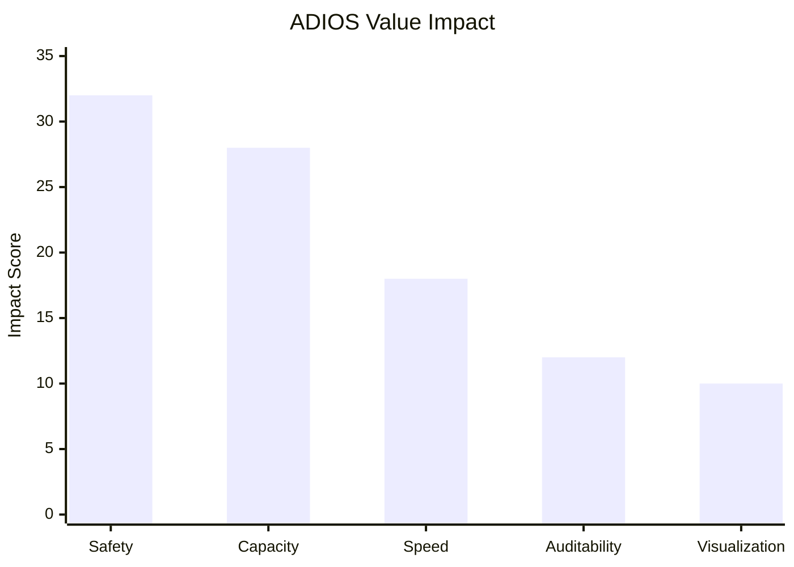
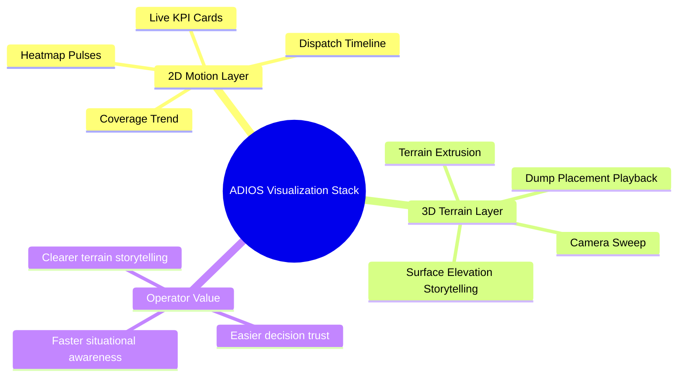
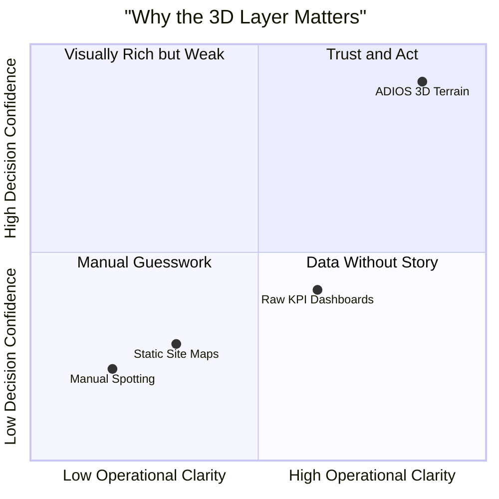
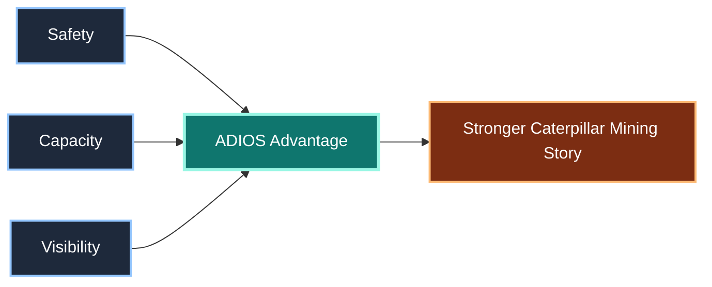

<div align="center">

<h1>
  ADIOS
</h1>

<h3>
  Adaptive Dump Intelligence &amp; Orchestration System
</h3>

```text
  █████╗ ██████╗ ██╗ ██████╗ ███████╗
 ██╔══██╗██╔══██╗██║██╔═══██╗██╔════╝
 ███████║██║  ██║██║██║   ██║███████╗
 ██╔══██║██║  ██║██║██║   ██║╚════██║
 ██║  ██║██████╔╝██║╚██████╔╝███████║
 ╚═╝  ╚═╝╚═════╝ ╚═╝ ╚═════╝ ╚══════╝
```


**Caterpillar Hackathon Submission by Team Butterfly**

[](https://nextjs.org/)
[](https://fastapi.tiangolo.com/)
[](#our-usps)
[](https://docs.pmnd.rs/react-three-fiber/getting-started/introduction)
[](#business-impact-for-caterpillar)
[](#mit-license)

</div>

---

## What ADIOS Is

ADIOS is an intelligent dump-site orchestration system that tells mining operations **where every incoming haul truck should dump next**. It combines live terrain awareness, policy-driven optimization, and visual control into a single operating layer that transforms dump placement from manual judgment into a **fast, repeatable, safety-aware dispatch decision**.

At its core, ADIOS is built to do three things exceptionally well: **protect access continuity, improve dump uniformity, and unlock more usable capacity from the same site footprint**.

> **From manual spotting to intelligent orchestration.**

## Architecture





## Visual Analytics

<div align="center">

</div>





## 3D Object Preview

<div align="center">

</div>

```stl
solid adios_terrain_mound
  facet normal 0 0 1
    outer loop
      vertex 0 0 0
      vertex 40 0 0
      vertex 20 20 18
    endloop
  endfacet
  facet normal 0 0 1
    outer loop
      vertex 40 0 0
      vertex 40 40 0
      vertex 20 20 18
    endloop
  endfacet
  facet normal 0 0 1
    outer loop
      vertex 40 40 0
      vertex 0 40 0
      vertex 20 20 18
    endloop
  endfacet
  facet normal 0 0 1
    outer loop
      vertex 0 40 0
      vertex 0 0 0
      vertex 20 20 18
    endloop
  endfacet
  facet normal 0 0 -1
    outer loop
      vertex 0 0 0
      vertex 40 40 0
      vertex 40 0 0
    endloop
  endfacet
  facet normal 0 0 -1
    outer loop
      vertex 0 0 0
      vertex 0 40 0
      vertex 40 40 0
    endloop
  endfacet
endsolid adios_terrain_mound
```



## Our USPs

| USP | Why It Matters |
| --- | --- |
| **Adaptive intelligence over static dump rules** | ADIOS reacts to terrain evolution in real time instead of following a rigid placement pattern. |
| **Safety-aware recommendation engine** | Dump locations are shaped by operational constraints, not just geometric convenience. |
| **Unified 2D + 3D decision experience** | Operators can understand site behavior through both analytics views and terrain visualization. |
| **Real-time orchestration stack** | FastAPI, ML inference, and R3F work together as one live decision loop. |
| **Audit-ready by design** | Every placement can be explained, reviewed, and improved using measurable signals. |
| **Built for Caterpillar-scale digital mining** | ADIOS aligns machine intelligence with field-ready operational workflows. |

## Impact Snapshot

| Dimension | Traditional Approach | ADIOS Advantage |
| --- | --- | --- |
| Placement decisions | Manual and experience-driven | AI-guided and repeatable |
| Terrain awareness | Fragmented and reactive | Live, model-backed, visual |
| Access continuity | Risk discovered late | Risk considered before placement |
| Surface quality | Hard to standardize | More uniform and controllable |
| Operational insight | Limited post-hoc review | Continuous KPI visibility |

## Business Impact for Caterpillar

| Business Outcome | Caterpillar Value |
| --- | --- |
| **Higher dump efficiency** | More usable capacity from existing dump zones means stronger operational performance for customers. |
| **Safer site execution** | Terrain-aware recommendations support more disciplined, lower-risk dumping behavior. |
| **Smarter digital product story** | ADIOS demonstrates how Caterpillar can extend beyond hardware into intelligent site orchestration. |
| **Better customer intelligence** | Every dispatch becomes operational data that can drive optimization, service, and future automation. |
| **Scalable innovation narrative** | The concept naturally expands toward fleet integration, autonomy support, and enterprise analytics. |

## Why It Wins



## MIT License

This project is released under the [MIT License](LICENSE).

---

<div align="center">

## Built With Vision by Team Butterfly

**Made by Team Butterfly**

*Engineering safer dump decisions, smarter terrain intelligence, and stronger outcomes for Caterpillar.*

</div>
