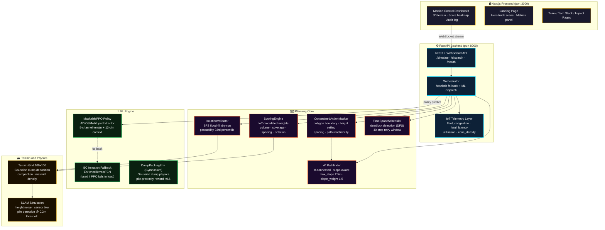
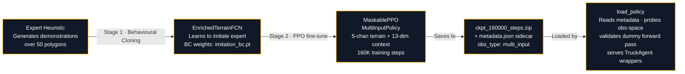
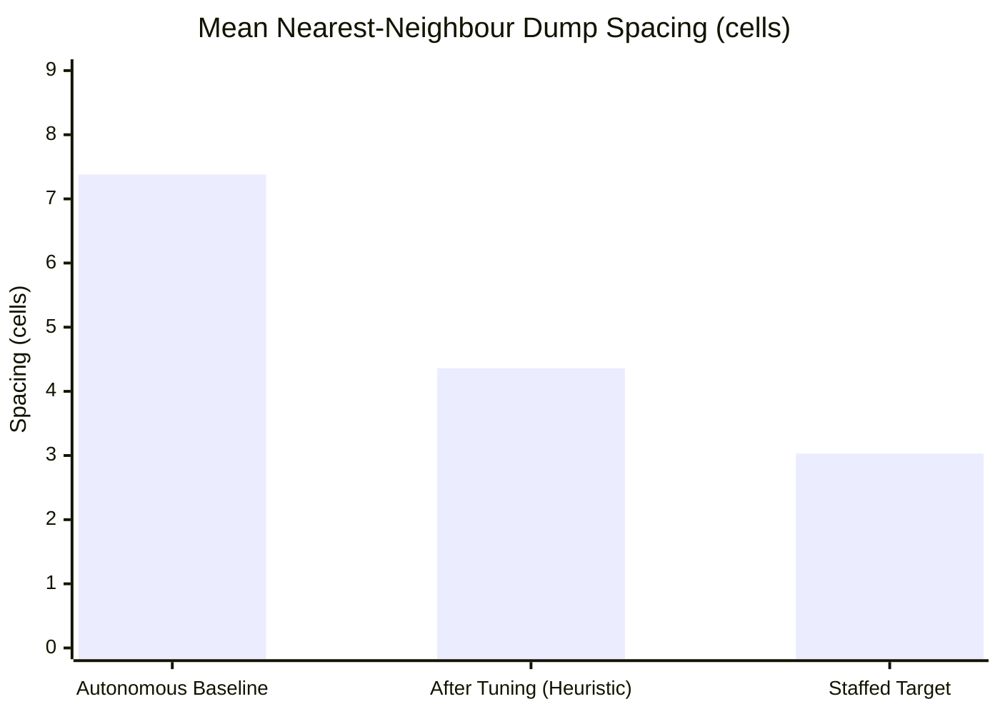
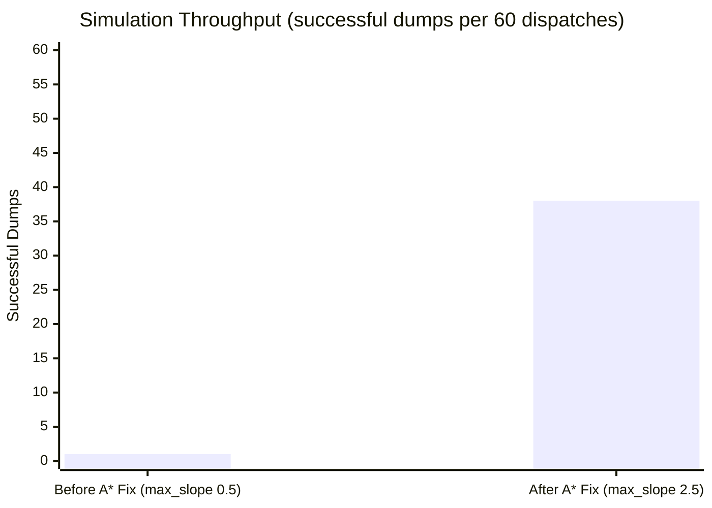
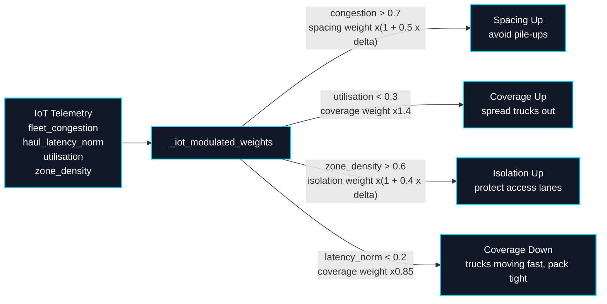

<!--
  README.md — Project overview, architecture, run guide, and ML training instructions for ADIOS.
  This file is the single source of truth for anyone trying to understand, run, or extend the system.
  CAT Hackathon submission — Problem Statement 4: Optimal Dump Packing
-->

<div align="center">

```
  █████╗ ██████╗ ██╗ ██████╗ ███████╗
 ██╔══██╗██╔══██╗██║██╔═══██╗██╔════╝
 ███████║██║  ██║██║██║   ██║███████╗
 ██╔══██║██║  ██║██║██║   ██║╚════██║
 ██║  ██║██████╔╝██║╚██████╔╝███████║
 ╚═╝  ╚═╝╚═════╝ ╚═╝ ╚═════╝ ╚══════╝
```

# ADIOS — Adaptive Dump Intelligence & Orchestration System


[](https://nextjs.org/)
[](https://fastapi.tiangolo.com/)
[](#ml-training)
[](https://docs.pmnd.rs/react-three-fiber)
[](#iot-adaptive-weight-modulation)

**Built by Team Butterfly** · Anushka Nair · Arjit Tripathi · Shivani Srivastava · Yashee Hinger

</div>

---

## What ADIOS Does

ADIOS answers one question per incoming haul truck: **where should this load be dumped next?**

Instead of relying on a human spotter or a fixed dump zone grid, ADIOS uses a trained reinforcement learning policy (MaskablePPO, 160K steps) backed by live terrain state, IoT fleet telemetry, constraint-aware action masking, and an A\* path planner to pick the single best cell on the dump site — every dispatch, every truck, in real time.

The result: dump piles are tighter, spacing is more uniform, access lanes stay open, and the site fills closer to a staffed human baseline (target 3.03m mean spacing vs. 7.38m autonomous baseline).

---

## System Architecture



---

## ML Pipeline — How The Policy Learns



**Why two stages?**
- **Stage 1 (BC)** gives the PPO a warm start — it doesn't have to explore randomly from scratch. The policy already knows roughly where to dump before PPO kicks in.
- **Stage 2 (PPO)** fine-tunes with real rewards: volume filled, spacing tightness, isolation safety, pile-proximity bonus. It learns to outperform the heuristic on unseen polygons.

---

## Observation Space — What The Policy Sees

Each truck gets a **Dict observation** with two components:

```
{
  "terrain_map":    shape (5, 100, 100)   ← 5-channel enriched terrain grid
  "context_vector": shape (13,)            ← per-truck + IoT features
}
```

| Channel | What It Encodes |
|---------|----------------|
| `ch0` — height_norm | Normalised dump height (0–1 over max 18m) |
| `ch1` — polygon mask | 1 = inside dump zone boundary, 0 = outside |
| `ch2` — dist_boundary | Distance to nearest boundary wall (normalised) |
| `ch3` — pile_mask | SLAM pile detection map (threshold 0.2m) |
| `ch4` — spacing_density | Gaussian density of existing dump centres |

| Context Index | Feature |
|--------------|---------|
| 0–3 | Truck type one-hot (Cat793 / Cat777 / Cat797 / generic) |
| 4 | Payload (normalised 0–1, ceiling 500t) |
| 5 | Dump count (normalised by max dumps) |
| 6 | Local density (normalised) |
| 7 | Compaction factor |
| 8 | Slope angle at current position |
| 9 | Fleet congestion (IoT) |
| 10 | Haul latency norm (IoT, 20-tick window) |
| 11 | Fleet utilisation (IoT) |
| 12 | Zone density (IoT) |

---

## Why The ZIP File? Can I Use The Unzipped Folder?

**Short answer: no — Stable Baselines3 only loads `.zip` files.**

When you call `MaskablePPO.load("ckpt_160000_steps")`, SB3 internally does this:

```python
# SB3 source (stable_baselines3/common/base_class.py)
path = str(path) + ".zip"              # always appends .zip
with zipfile.ZipFile(path, "r") as zf:
    data   = json.loads(zf.read("data"))           # model config JSON
    params = th.load(zf.open("policy.pth"))        # policy network weights
    opt    = th.load(zf.open("policy.optimizer.pth"))
```

It expects specific entries inside the zip — it does **not** support loading from a plain directory. The `ckpt_160000_steps/` folder is only useful for:

- **Inspecting** individual files (`policy.pth`, `data`, `system_info.txt`)
- **Reading** `metadata.json` — our custom sidecar that lets `load_policy()` validate the obs-space without a full model load
- **Debugging** architecture mismatches by reading `data` directly

If you accidentally delete the zip after unzipping, recreate it:

```bash
cd backend/ml/weights
zip -j ckpt_160000_steps.zip ckpt_160000_steps/*
```

---

## Spacing Gap — Before vs. After





---

## IoT Adaptive Weight Modulation

At every heuristic dispatch, live telemetry shifts the scoring weights in real time — no retraining needed:



---

## Key Parameter Changes

| Parameter | Before | After | Why |
|-----------|--------|-------|-----|
| `min_dump_spacing_cells` | 3.0 | **2.0** | Close gap to staffed 3.03m target |
| `iso_threshold` | 0.85 | **0.88** | Better balance: safety vs throughput |
| `dump_radius_cells` | 8 | **6** | Tighter pile footprint |
| `dump_sigma_ratio` | 0.45 | **0.35** | Higher peak density per pile |
| `spacing` score weight | 1.5 | **3.0** | Penalise gaps 2x harder |
| `volume` score weight | 1.0 | **1.5** | Prefer cells that fill more material |
| `coverage` score weight | 1.0 | **1.8** | Prefer unfilled polygon sections |
| `passability_percentile` | 97 | **93** | Less restrictive BFS ceiling → more valid paths |
| `scheduler_max_delay_steps` | 25 | **40** | More scheduler retries → fewer deadlocks |
| `pile_detection_threshold_m` | 0.3m | **0.2m** | Earlier SLAM pile sensing |
| `A* max_slope` | 0.5m | **2.5m** | **Critical fix** — 0.5m blocked all paths on real pile heights |
| `iot_haul_latency_window` | 10 ticks | **20 ticks** | Smoother IoT signal |
| `max_height_m` | 15m | **18m** | More vertical fill before rejection |

---

## Project Structure

```
adaptive-dump-intelligence/
├── backend/
│   ├── api/
│   │   └── main.py                    # FastAPI app — REST + WebSocket endpoints
│   ├── config.py                      # All tunable constants (single source of truth)
│   ├── environment/
│   │   ├── terrain.py                 # Terrain grid, Gaussian dump physics, SLAM
│   │   └── dump_physics.py            # Compaction and material density calculations
│   ├── evaluation/
│   │   ├── benchmark.py               # 20-polygon benchmark suite
│   │   ├── compute_eval.py            # PPO vs heuristic KPI comparison
│   │   └── metrics.py                 # Coverage, spacing, efficiency metrics
│   ├── iot/
│   │   └── telemetry.py               # Fleet IoT telemetry (congestion, latency, etc.)
│   ├── ml/
│   │   ├── environment.py             # DumpPackingEnv (Gymnasium, 5-channel obs)
│   │   ├── policy.py                  # load_policy(), ADIOSMultiInputExtractor, TruckAgent
│   │   ├── data_gen.py                # Expert demonstration generator (for BC)
│   │   ├── train_supervised.py        # Stage 1: behavioural cloning trainer
│   │   └── weights/
│   │       ├── ckpt_160000_steps/     # Unzipped checkpoint — inspect only
│   │       │   ├── policy.pth
│   │       │   ├── policy.optimizer.pth
│   │       │   ├── pytorch_variables.pth
│   │       │   ├── data
│   │       │   └── metadata.json      # Custom obs-space sidecar
│   │       ├── ckpt_160000_steps.zip  # ← SB3 loads THIS (must exist)
│   │       └── ppo_adios/
│   │           ├── imitation_bc.pt    # BC fallback weights
│   │           └── metadata.json      # Marks as bc_imitation type
│   ├── planning/
│   │   ├── orchestrator.py            # Dispatch loop — ML + heuristic paths
│   │   ├── scorer.py                  # ScoringEngine + IoT weight modulation
│   │   ├── isolation_validator.py     # BFS flood-fill isolation check
│   │   ├── action_masker.py           # ConstrainedActionMasker
│   │   ├── pathfinder.py              # A* slope-aware grid pathfinder
│   │   ├── scheduler.py               # TimeSpaceScheduler + deadlock detection
│   │   └── weight_tuner.py            # Random-search weight optimiser
│   ├── pretrain.py                    # Main training entry point (BC then PPO)
│   └── requirements.txt
│
└── frontend/
    ├── src/
    │   ├── app/
    │   │   ├── page.tsx               # Landing page (hero truck scene + metrics)
    │   │   ├── dashboard/             # Live simulation dashboard
    │   │   ├── audit/                 # Audit log replay
    │   │   ├── scheduling/            # Gantt chart scheduling view
    │   │   ├── intelligence/          # ML engine explainer
    │   │   ├── impact/                # Business impact page
    │   │   ├── team/                  # Team page (4 members)
    │   │   └── tech-stack/            # Tech stack overview
    │   ├── components/
    │   │   ├── landing/               # LandingHeroScene (React Three Fiber)
    │   │   └── dashboard/             # MetricsPanel, BenchmarkPanel, ControlPanel
    │   ├── lib/api.ts                 # API client (REST + WebSocket)
    │   ├── store/simStore.ts          # Zustand simulation state
    │   └── types/adios.ts             # Shared TypeScript types
    └── package.json
```

---

## How To Run

### Prerequisites

- Python 3.11+
- Node.js 18+
- ~4 GB RAM (for PPO inference)

---

### Step 1 · Backend Setup

```bash
# Enter the backend folder
cd backend

# Create a virtual environment (keeps dependencies isolated)
python3 -m venv .venv

# Activate it
source .venv/bin/activate          # Mac / Linux
# .venv\Scripts\activate           # Windows

# Install all Python dependencies
pip install -r requirements.txt

# Also install sb3-contrib for MaskablePPO (required for PPO inference)
pip install sb3-contrib
```

---

### Step 2 · Start The Backend Server

```bash
# Make sure you're in backend/ with .venv active
cd backend
source .venv/bin/activate

# Start FastAPI (auto-reloads on file changes during development)
uvicorn api.main:app --reload --port 8000
```

Expected output:
```
INFO:     Policy loaded: Maskable PPO (IoT-Enriched)
INFO:     Uvicorn running on http://127.0.0.1:8000
```

Verify at `http://localhost:8000/health`:
```json
{
  "status": "ok",
  "policy_type": "maskable_ppo",
  "policy_display_name": "Maskable PPO (IoT-Enriched)"
}
```

> If you see `"policy_display_name": "heuristic"`, the PPO weights didn't load.
> Check that `backend/ml/weights/ckpt_160000_steps.zip` exists.
> If missing: `cd backend/ml/weights && zip -j ckpt_160000_steps.zip ckpt_160000_steps/*`

---

### Step 3 · Start The Frontend

```bash
# Open a new terminal tab (keep the backend running in the other one)
cd frontend

# Install Node dependencies
npm install

# Start the dev server
npm run dev
```

Open `http://localhost:3000` — the landing page loads with the 3D truck scene.

For a production build:
```bash
npm run build
npm start
```

---

### Step 4 · ML Training (Optional — weights already included)

You don't need to train to run the demo. The 160K-step checkpoint is already in the repo. But if you want to train a fresh policy:

```bash
cd backend
source .venv/bin/activate

# Default: 100K steps on CPU (~3 minutes, demo quality)
python pretrain.py

# Recommended: 200K steps for better convergence (~6 minutes on CPU)
python pretrain.py --steps 200000

# Skip BC stage and go straight to PPO (faster, slightly worse warm start)
python pretrain.py --steps 200000 --skip-bc

# Custom output path
python pretrain.py --steps 200000 --out ml/weights/my_new_run
```

What gets created after training:
```
ml/weights/ppo_adios/
├── ppo_adios.zip          ← SB3 PPO checkpoint (this is what gets loaded)
├── imitation_bc.pt        ← BC fallback weights (Stage 1 output)
├── metadata.json          ← obs-space sidecar (obs_type: multi_input)
└── eval_result.json       ← PPO vs heuristic efficiency delta
```

To use your new weights, update `WEIGHTS_PATH` in `backend/api/main.py`:
```python
WEIGHTS_PATH = Path(__file__).parent.parent / "ml" / "weights" / "ppo_adios"
```

---

### Step 5 · Run Benchmark Evaluation (Optional)

Compare PPO vs heuristic across 20 held-out polygons and print all 10 KPIs:

```bash
cd backend
source .venv/bin/activate

python -m evaluation.compute_eval
```

---

## Troubleshooting

| Symptom | Fix |
|---------|-----|
| `ModuleNotFoundError: sb3_contrib` | `pip install sb3-contrib` |
| Health shows `"heuristic"` instead of PPO | Ensure `ckpt_160000_steps.zip` exists in `backend/ml/weights/` |
| All simulation dispatches fail with `path_unreachable` | Verify `max_slope=2.5` in [planning/pathfinder.py:14](backend/planning/pathfinder.py) |
| Frontend can't connect to backend | Backend must be on port 8000; check CORS (enabled by default in `main.py`) |
| Need to recreate the zip after unzipping | `cd backend/ml/weights && zip -j ckpt_160000_steps.zip ckpt_160000_steps/*` |
| Port 3000 already in use | `npm run dev -- --port 3001` |
| Port 8000 already in use | `uvicorn api.main:app --port 8001` then update `frontend/src/lib/config.ts` |

---

## Tech Stack

| Layer | Technology |
|-------|-----------|
| Frontend framework | Next.js 15 (App Router) |
| 3D rendering | React Three Fiber + Three.js |
| Animations | Framer Motion + GSAP |
| State management | Zustand |
| Backend framework | FastAPI + Uvicorn |
| WebSocket streaming | FastAPI WebSocket |
| RL framework | Stable Baselines 3 + sb3_contrib |
| Policy type | MaskablePPO (MultiInputPolicy) |
| Neural net | PyTorch 2.11 |
| Environment | Gymnasium (custom DumpPackingEnv) |
| Terrain physics | NumPy · SciPy Gaussian |
| Path planning | Custom A\* (8-connected, slope-aware) |
| IoT telemetry | Custom rolling-window telemetry layer |

---

<div align="center">

## Built by Team Butterfly

**Anushka Nair · Arjit Tripathi · Shivani Srivastava · Yashee Hinger**

*Safer placement. Higher capacity. Smarter terrain.*

</div>
