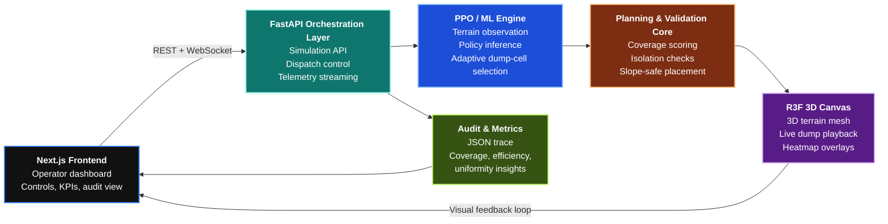

# ADIOS
### Adaptive Dump Intelligence & Orchestration System

**Caterpillar Hackathon Submission by Team Butterfly**

---

## What ADIOS Is

ADIOS is an intelligent dump-site orchestration system that helps mining operations decide **where every incoming haul truck should dump next**. It combines a live digital terrain model, optimization logic, and machine learning to turn dump placement from a manual judgment call into a **repeatable, data-driven dispatch decision**.

Its purpose is simple: **maximize usable dump capacity, preserve safe access paths, and maintain a more uniform terrain surface in real time**.

## Our USPs

- **Adaptive intelligence over static rules:** ADIOS evaluates the evolving terrain continuously instead of relying on fixed dump patterns or operator intuition alone.
- **Safety-aware dispatching:** Each recommended dump location is shaped by reachability and terrain constraints, helping reduce the risk of inaccessible or poorly formed dump zones.
- **Digital twin visibility:** Operators can see the dump surface, heatmap behavior, and placement evolution through an interactive 3D visualization layer.
- **Real-time decision support:** FastAPI streams decisions and simulation state quickly enough to support operational workflows, not just offline analysis.
- **Audit-ready orchestration:** Every simulated placement can be traced back through metrics and logs, making the system easier to trust, explain, and improve.
- **Built for Caterpillar-scale modernization:** ADIOS connects machine intelligence, operational control, and visual analytics in one stack instead of treating them as separate tools.

## Business Impact for Caterpillar

- **Higher dump efficiency:** Smarter placement decisions can improve usable dump capacity and reduce waste caused by uneven or suboptimal fill patterns.
- **Safer operations:** Better terrain-aware routing logic supports more controlled dumping behavior and helps protect haul access continuity.
- **Stronger product differentiation:** ADIOS demonstrates how Caterpillar can pair equipment leadership with intelligent site orchestration and digital decision support.
- **More actionable data for customers:** The platform turns dump activity into measurable operational intelligence rather than leaving value locked inside manual decisions.
- **A scalable innovation story:** This is the kind of system that can evolve from hackathon prototype to fleet-integrated mining technology narrative.

## MIT License

This project is released under the [MIT License](LICENSE).

Made by Team Butterfly
